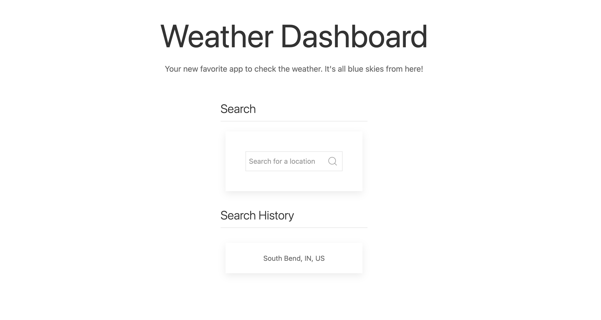
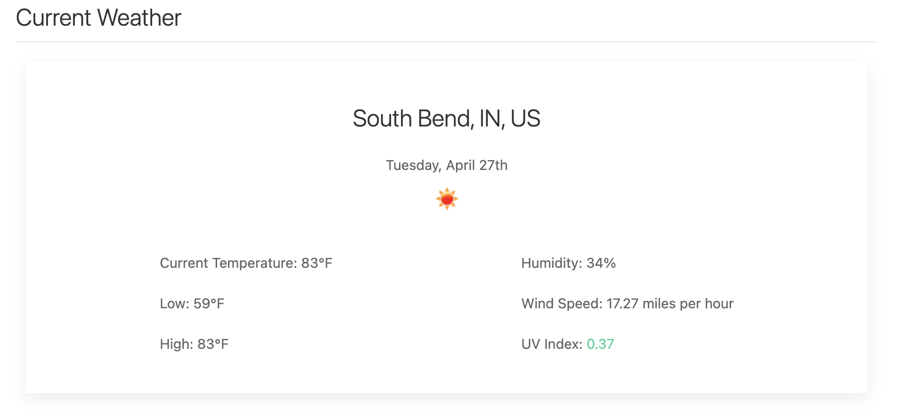
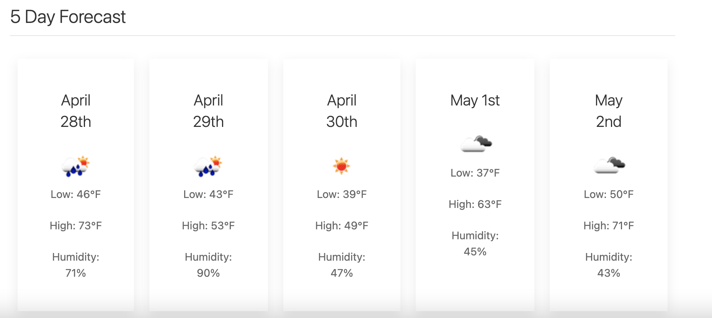

# JavaScript Code Quiz

## Description 

This week I was challenged with creating an app with the help of APIs to display the weather. You can see my website below displaying the beautiful weather from my hometown South Bend, Indiana! 

Overall this was a difficult project, but one that was fun to show off once finished with. 

## Site Location

[Site Location](https://abbycav7.github.io/js-code-quiz/)

## Site Image

